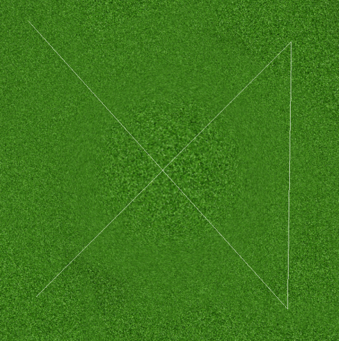
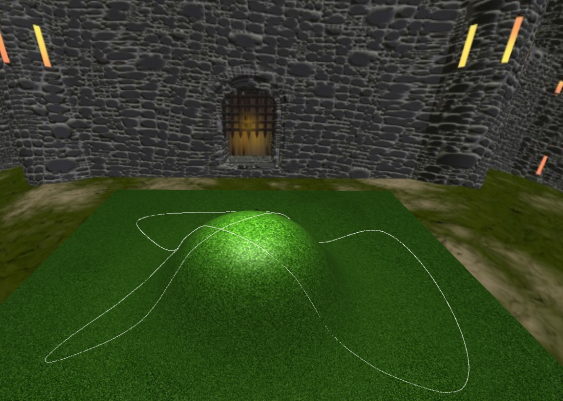
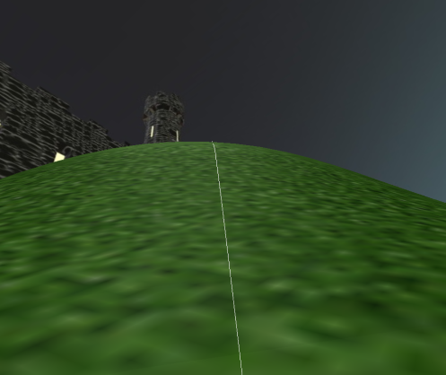

# OpenGL Playground

This is a simple opengl program that loads a grass terrain with a hill inside of a skybox and a basic light source. The user can choose points on the terrain and it will calculate a path using a Catmull-Rom spline interpolation algorithm. Once the path is generated, an object will be created and the path will be used as its track. The user can switch views by choosing the camera at the object giving the user a first person view while the object travels along the path with the options to control the velocity and to control the camera to look around.

## Prerequisites

This program depends on the following

### Libraries:

GLEW, GLFW3, GLM, [SOIL](http://www.lonesock.net/files/soil.zip), [CImg](http://cimg.eu/download.shtml)

### Tools:

CMake

## Screenshots

### Draw lines (or points)

### After interpolation

### Camera view

## Controls

### Toggle Draw Mode
* P -> Points
* L -> LineStrip
* S -> Lines
* T -> TriangleStrip
* Y -> Triangles

### Camera Control
* Keypad Multiply -> Set Projetion to orthographic
* Keypad Divide -> Set Projection to perspective
* Left -> Move left
* Right -> Move right
* Up -> Move Forward
* Down ->Move Backward
* Page Up -> Move Up
* Page Down -> Move Down
* Keypad Add -> Zoom In
* Keyapad Subtract -> Zoom out
* A -> Toggle action cam (on top of moving object)
* Mouse Direction while pressing on wheel -> Rotation

### Light Control
* Keypad 4 -> Move left
* Keypad 6 -> Move right
* Keypad 8 -> Move forward
* Keypad 2 -> Move backward
* Keypad 0 -> Move up
* Keypad Decimal -> Move down
* Keypad 7 -> Decrease Power
* Keypad 9 -> Increase Power
* Keypad 5 -> Toggle On/Off

### Action Controls
* Left Mouse Button -> Add points to spline
* Enter -> Generate Spline and load object onto path to start moving
* Backspace -> Clear everyhting
* Comma -> Decrease object speed;
* Period -> Increase object speed.